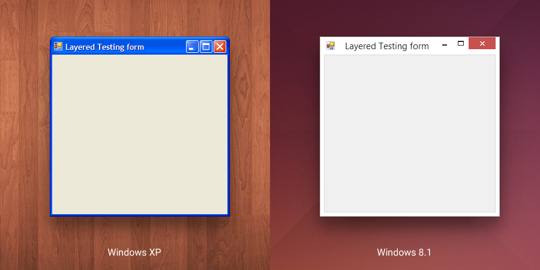
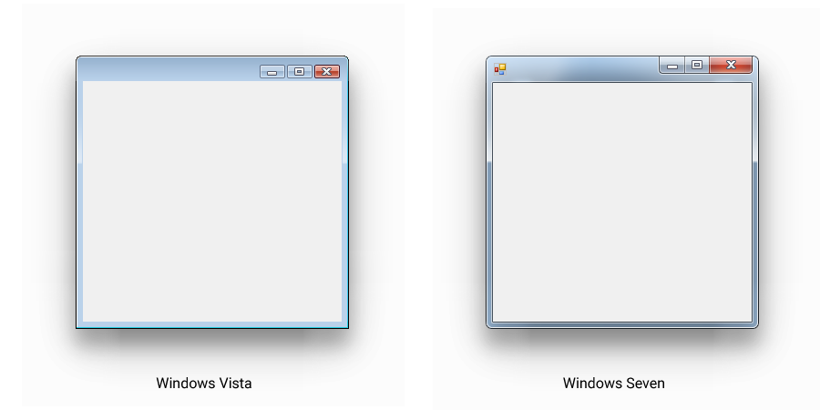
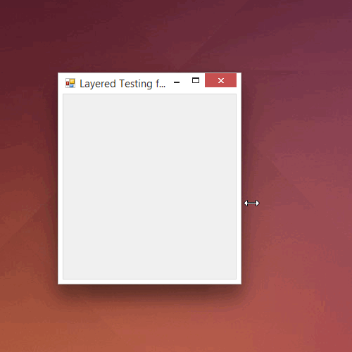
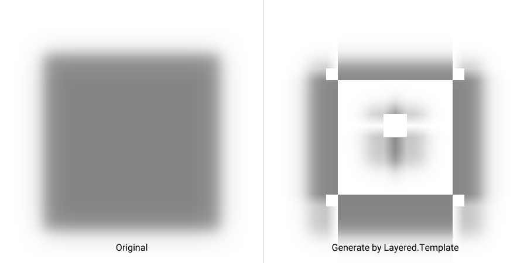

# Layered

Layered designed to display a shadow or glow, under target form. Developed for WinForms, under .Net 2.0 without external dependencies. There are two projects, one of them is actual library, and the other one, an example of how to use Layered. Tested under Windows XP/Vista/7/8.1.

## Current version 0.6.0.0
I think, there is still a few things, that can be optimized or simplified, time will tell.

-----

## Few tips
- The size of original bitmap must be such size, so it could be divided on three parts. Simple example: 600x600 / 3 = 200x200; Each part will represent a corner or side. Dont worry about empty-space, `Layered.Template` will cut it off;
- Pixel format of original bitmap must be 32bppArgb. It means, that your bitmap must have at least one transparent pixel, so Photoshop or any other editor would write alpha-channel;
- In Photoshop, when using drop shadow, make sure to uncheck "Layer Knocks Out Drop Shadow". And, look what happens, if you have a hole inside shadow-rectangle;

## How it was developed

We could use single layered window, instead of four, but performance would suffer depending on how large layered window would be. Using four windows works great, but in this case we have one problem - not always, all four windows might be moved and resized at the same time. For some misterious reasons even DeferWindowPos doesn't work with layered windows.

That's why, before using `Layered.Theme`, you need to generate bitmap with help of `Layered.Template` class. Each window will be crossed with two neighbors, and thanks to gradients, when movement or resize of window will be delayed, everything, still, will look good.

-----

Layered is free for both types of projects, commercial and non-comercial. Yes, money would be good, but only if this library really helps you, and only if you want to thank me this way.